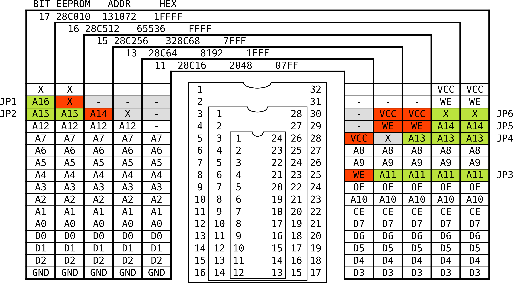
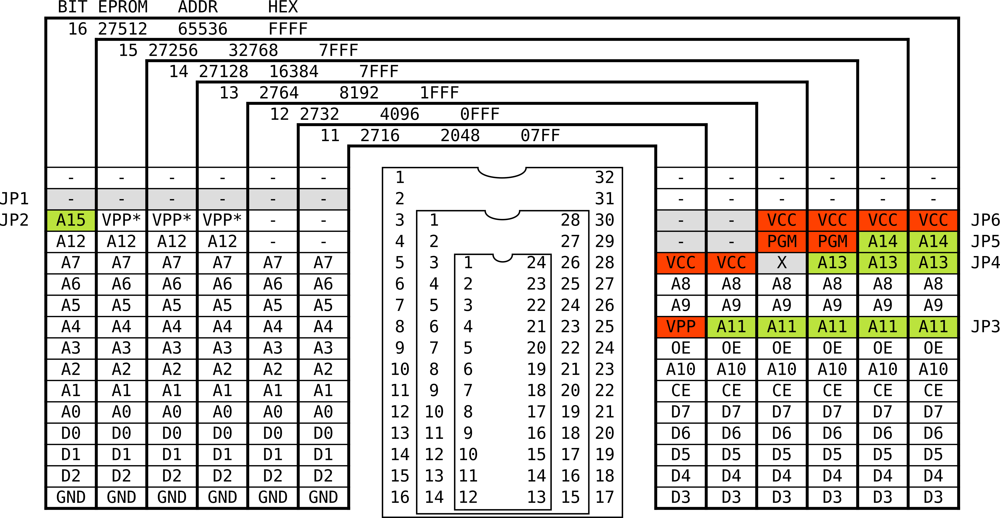

# ÜRP - Über Retro Programmer

An EEPROM programmer for retro playing.
- Can dump most parallel (EE)PROM memories, like 27xxx and 28xxx.
- Supports RW operations of most 28Cxxx EEPROM.
- Suppport may be extended to flash memories up to 1MiB.

## What's inside

This repository is organized as follows
```
ÜRP
 |__ hw          --> KiCAD schematics
 |   |__ gerbers  -> fabrication files (gerbers)
 |   |__ urp.pdf  -> PDF schematic
 |   |__ urp.pro  -> KiCAD project
 |__ fw          --> source code for atmega 328
 |__ sw          --> source code for PC Command Line Interface
 |__ docs        --> files related to documentation
```

## Assemblaggio della PCB


|Designator      | Description                  | Notes                   |
|----------------|------------------------------|-------------------------|
|C1-C5           | capacitor ceramic 100n P5.08 |                         |
|C6-C7           | capacitor ceramic 22p P2.54  |                         |
|R1              | resistor 10k                 |                         |
|R2-R4           | resistor 330                 |                         |
|Y1              | crystal 16M                  |                         |
|SW1             | Tactile switch               |                         |
|D1-D3           | LED 5mm                      | e.g. green, yellow, red |
|U1              | microcontroller ATMega 328   |                         |
|U2 U3           | shift register 74HC595       |                         |
|JP1-JP5         | 3-pin header 2.54            | EEPROM size selection   |
|J1              | 6-pin header 2.54            |                         |
|J2              | ZIF socket 32 pin wide       |                         |
|J3              | 2-pin header 2.54            | optional                |
|R5              | resistor 10k                 | optional                |
|R6              | resistor 3k3                 | optional                |
|Q1              | PMOS (2N7002)                | optional                |

**Warning:** When Q1 is not mounted, JP7 must be shorted.

## How to compile and load firmware

1. Mount atmega328 on an Arduino UNO board or equivalent. If is a fresh chip, you must load an Arduino compatible bootloader (e.g. optiboot).

1. Compile firmware in `fw` folder using the makefile. Change `/dev/ttyXYZ123` with the correct serial port (e.g. /dev/ttyUSB0);

    cd fw
    make
    make program AVRDUDEPORT=/dev/ttyXYZ123

1. Move the atmega328 on the ÜRP.

### How to use EEPROM size selection pins


Jumpers JP1-JP6 must be placed according to memory size and technology.
Each jumper has three positions, 1 (green), 2 (red) or unmounted (gray).
Please refer to the following tables for correct placement.

#### EEPROM pinout



#### EPROM pinout

**Notes:**
- EPROM support is read only;
- Most EPROM have VPP on JP2. Datasheet recommends to put VPP=VCC during reading operations. I often keep JP2 in position (1) and make read operations starting from 32768 (A15=VCC).




## How to compile CLI

    cd sw
    make

### CLI options

    Usage: ./serprog options

    -r --read arg                read the content of eeprom in file. Must specify size and addr
    -w --write arg               write the content of file in eeprom, then verify. Must specify addr
    -v --verify arg              verify the content of the file with the eeprom. Must specify addr
    -n --noverify                skip verification after write
    -e --erase                   erase the eeprom (by software, i.e. write FF)
    -V --verbose [arg]           set verbosity level to arg (0 low, 7 high)
    -s --size arg                set reading size
    -a --addr arg                set starting address (default 0)
    -d --device arg              set serial device (default /dev/ttyUSB0)
    -U --unlock                  unlock before
    -P --lock                    lock after
    -h --help                    print this help

#### Read a 28C256 EEPROM (8KiB)

    ./serprog --device /dev/ttyACMx --read dump.bin -s 8192

#### Write a binary image

    ./serprog --device /dev/ttyACMx --write dump.bin

If the EEPROM fails verify, SDP (Software Data Protection) may be on.
Try disabling.

    ./serprog --device /dev/ttyACMx -U --write dump.bin

In both cases, size is deducted from the binary image.

#### Manually verify against a binary image

    ./serprog --device /dev/ttyACMx --verify dump.bin

Size is deducted from the binary image.

#### Protect EEPROM with SDP

    ./serprog --device /dev/ttyACMx -P